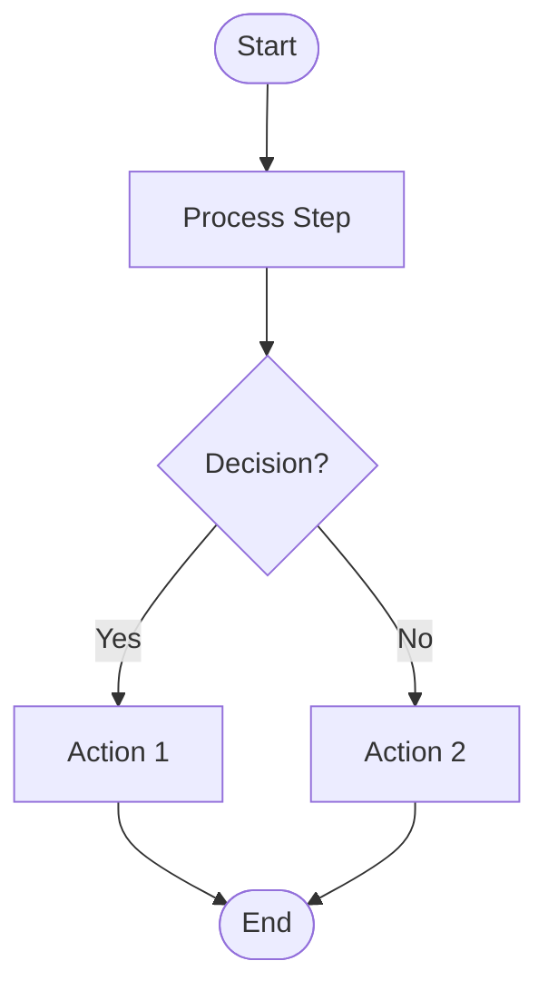
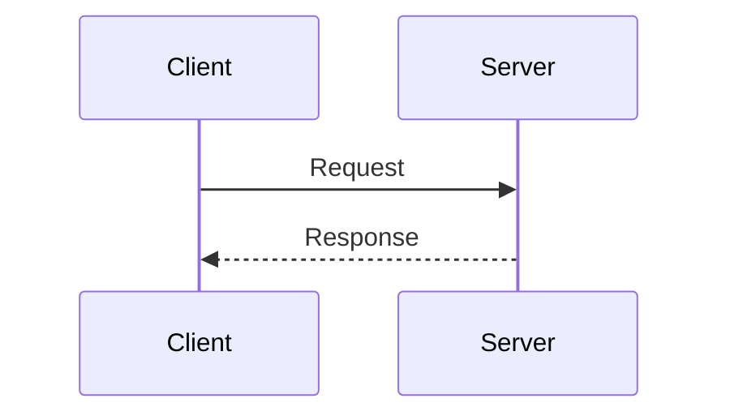
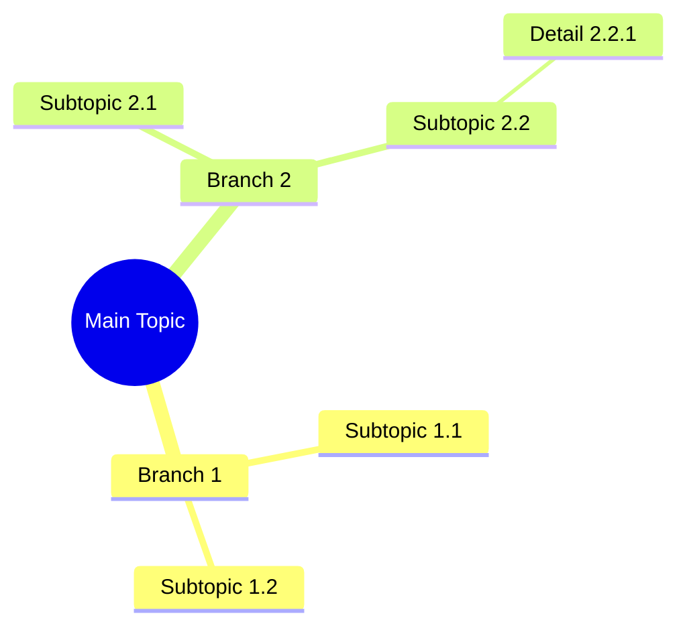

# Diagram Converter Tool 🎨🛠️ | Flowchart Perfected


> 🚀 **Convert Mermaid diagrams to Draw.io XML and Markdown docs—automated, beautiful, and fast!**

---

## 📖 Table of Contents

- [Features](#features)
- [Recent Improvements](#recent-improvements)
- [Installation](#installation)
- [Usage](#usage)
- [Supported Diagram Types](#supported-diagram-types)
- [Output Formats](#output-formats)
- [File Structure](#file-structure)
- [How It Works](#how-it-works)
- [Advanced Features](#advanced-features)
- [Programmatic Usage](#programmatic-usage)
- [Conversion Rules](#conversion-rules)
- [Limitations](#limitations)
- [Troubleshooting](#troubleshooting)
- [Contributing](#contributing)
- [License](#license)
- [Support](#support)

---

## ✨ Features

- ⚡ **Mermaid → Draw.io**: Convert Mermaid diagrams (flowcharts, sequences, mindmaps) to editable Draw.io XML.
- 📝 **Markdown Docs**: Auto-generate clear Markdown documentation.
- 🧠 **Dagre-powered Layout**: Professional graph layout with clean edge routing.
- 🔄 **Multi-Diagram Support**: Handles branches, cycles, merges, and decision points.
- 🚀 **CLI Integration**: Plug into build, CI/CD, or doc workflows.

---

## 🚀 Recent Improvements

- 🛰️ **Dagre Integration**: Replaced custom layouts for smarter node positioning.
- ↔️ **Smart Edge Routing**: Edges avoid crossing nodes.
- 🪄 **Flowchart Upgrades**: Handles complex logic perfectly.
- 🔒 **Backward Compatibility**: Your old diagrams still work!

---

<details>
  <summary><b>🛠️ Installation</b></summary>

```bash
# Prerequisites:
node -v # Node.js v14+
npm -v

# Clone & Install:
git clone https://github.com/DisanduP/Diagram-Converter-Tool-Flowchart-Perfected.git
cd Diagram-Converter-Tool-Flowchart-Perfected
npm install
```
</details>

---

## 💻 Usage

<details>
  <summary><b>Basic CLI Commands</b></summary>

```bash
# Convert Mermaid to Draw.io XML
node diagram-cli.js to-drawio your-diagram.mmd

# Generate Markdown
node diagram-cli.js to-markdown your-diagram.mmd

# Full conversion
node diagram-cli.js convert your-diagram.mmd

# Validate Mermaid syntax
node diagram-cli.js validate your-diagram.mmd
```
</details>

<details>
  <summary><b>Advanced CLI Options</b></summary>

```bash
node diagram-cli.js to-drawio <file.mmd> [options]

# Options:
-d, --output-dir <dir>    Output directory (default: current)
-n, --name <name>         Diagram name
-q, --quiet               Suppress info messages
```
</details>

#### Examples

```bash
node diagram-cli.js to-drawio flowchart.mmd -o flowchart.drawio
node diagram-cli.js to-markdown sequence.mmd -o sequence-docs.md
node diagram-cli.js convert flowchart.mmd -d ./output
node diagram-cli.js validate diagram.mmd --json
cat diagram.mmd | node diagram-cli.js to-drawio - -o output.drawio
```

---

## 🌈 Supported Diagram Types

### Flowcharts



- `[ ]` Rectangle `( )` Rounded `{ }` Diamond `[[ ]]` Subroutine
- `([ ])` Stadium `(( ))` Circle

### Sequence Diagrams



### Mindmaps



---

## 📦 Output Formats

### Draw.io XML

- Open in [app.diagrams.net](https://app.diagrams.net)
- Edit with VS Code Draw.io extension
- Import in tools (Confluence, Notion...)

### Markdown

- Diagram overview & type
- Node/shapes table
- Relationship table
- Subgraph docs
- Mermaid code included

---

## 🗂️ File Structure

```text
diagram-cli.js          # CLI interface
mermaid-parser.js       # Mermaid parser
drawio-converter.js     # Draw.io generator (Dagre-powered)
markdown-converter.js   # Markdown generator
index.js                # Entry point
package.json            # Dependencies
```

---

## ⚙️ How It Works

1. **Parse:** Mermaid syntax → data structures.
2. **Layout:** Dagre calculates coordinates.
3. **Convert:** Output Draw.io XML.
4. **Docs:** Auto-generate Markdown.

---

## 🦾 Advanced Features

- 🟦 **Automatic Layout**
- 🟩 **Edge Avoidance**
- 🟨 **Shape Recognition**
- 🟧 **Label Support**

---

## 🔥 Programmatic Usage

```js
const { parseMermaid, toDrawio, toMarkdown } = require('./diagram-converter');

const mermaidCode = `
flowchart TD
  A[Start] --> B[End]
`;

const parsed = parseMermaid(mermaidCode);
const xml = toDrawio(parsed, { name: 'My Diagram' });
const markdown = toMarkdown(parsed, mermaidCode);
```

---

## 📜 Conversion Rules

> Follows the BMAD Diagram Converter agent's ruleset:

1. **Node IDs:** Alphanumeric + underscores
2. **Arrows:** `-->` / `---`
3. **Direction:** TD, LR, RL, BT
4. **Grid:** Rounded coordinates
5. **Unique IDs:** For Draw.io nodes

---

## ⚠️ Limitations

- Complex Mermaid styles may not convert 1:1 to Draw.io.
- Some features require breaking chained arrows for clarity.

---

## 🛠️ Troubleshooting

> **Tip:** Use `validate` before converting!

- Node.js/npm errors? Run `npm install` again.
- Mermaid syntax? Check with the `validate` command.
- Layout issues? Try simplifying diagrams.

---

## 🤝 Contributing

1. Fork project
2. Branch + code
3. Test diagrams
4. PR 🚀

---

## 📄 License

**ISC License** — see `package.json`

---

## 💬 Support

Open a GitHub issue or contact the maintainer.

---

> **Note**: Optimized for automated, professional flowcharts. For basic diagrams, Draw.io import may suffice, but this tool is tailored for CI/CD and complex workflows!
